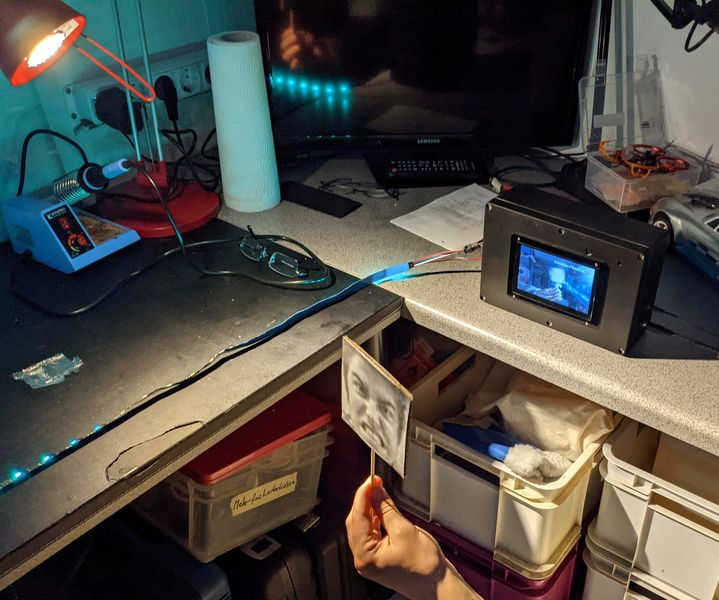

# Medieninformatik-Projekt Wintersemester 20/21

- Michael Smirnov (minf103430) 6. Fachsemester
- Len Harmsen (minf103760) 5. Fachsemester
- Alina von der Heide (minf103647) 5. Fachsemester
- Annalisa Anzioso (minf103575) 5. Fachsemester

## Impressionen

## Anforderungen (zu Beginn des Projekts)

### Gesichtserkennung

Über die Kamera des PI’s soll die Umgebung laufend gefilmt werden. Dabei soll in dem Kamerabild ein Gesicht gesucht werden, um dessen Emotion zu erkennen.
Bei der Emotion handelt es sich um ein Element aus einer vordefinierten Menge. Diese Emotion wird an ein weiteres Modul weitergereicht, welches sich um die Musik und Lichtstimmung im Raum kümmert.
Als zusätzliches Feature wäre denkbar ein Foto über eine Webseite hochzuladen, welche aus dem lokalen Netz heraus erreichbar wäre. Dieses könnte dann ebenfalls von dem Gesichtserkennungs-Modul verarbeitet werden.

### Musik

Wurde eine Stimmung erkannt, soll der PI aus einer vordefinierten Playlist einen zur Stimmung passenden Song auswählen und abspielen (über den internen Aux-Anschluss).
Zusätzlich wäre denkbar diese Songs über eine Python API aus Spotify Playlists, welche zu jeder Stimmung zugeordnet sind, abzuspielen.

### Licht

Das Licht wird an die erkannte Stimmung angepasst. Jede Stimmung bekommt dabei eine Farbe zugeordnet. Eine Erweiterung wären dann unterschiedliche Lichtprogramme, welche je nach erkannter Emotion eine passende Stimmung im Raum verbreiten sollen.
